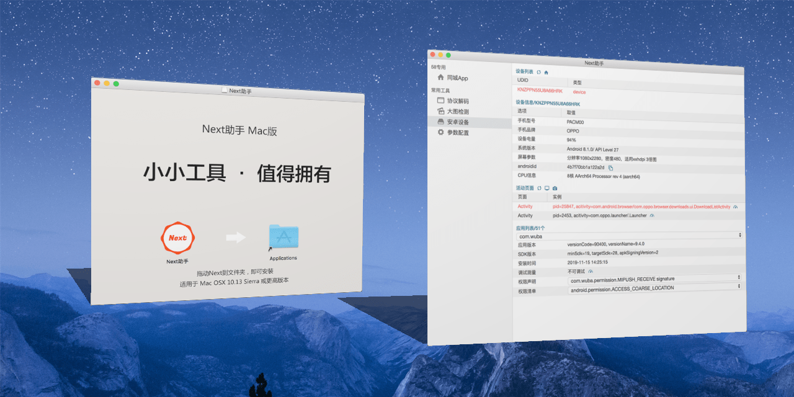
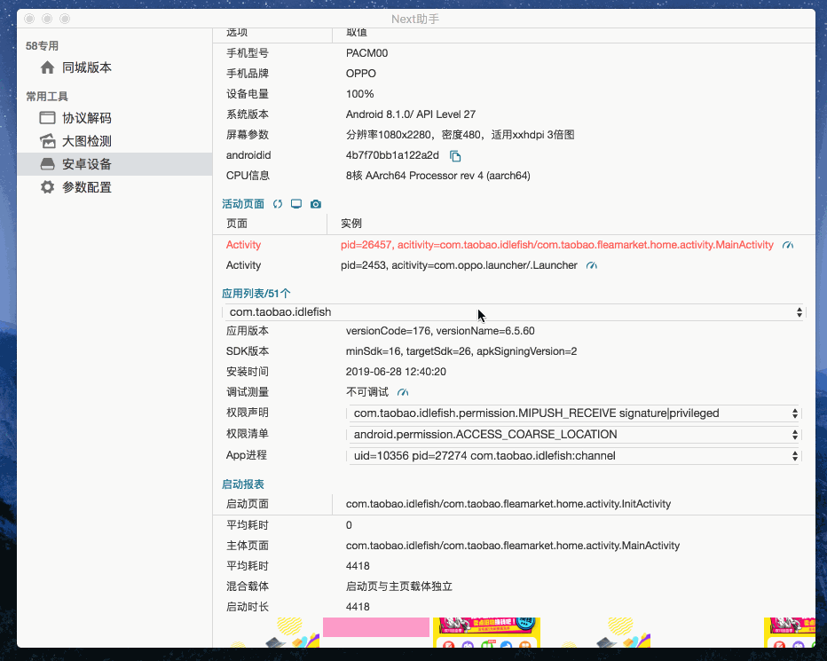

# Next For Mac
一款基于`Electron`框架开发的Mac应用，用于App启动速度`傻瓜式`评测，同时提供了针对Android设备的一些常用操作。

> 1. 软件源自笔者在进行App启动优化过程中的一些实践;
>
> 2. 开源版本剪裁了一些内部工具，仅提供业务无关的功能。

## 安装
下载最新`dmg`镜像，拖拽安装。

## 功能

### 设备管理

* **设备管理**： 显示当前连接PC的Android设备情况，包括USB和Wireless连接情况。
* **设备信息**：显示设备的基础信息，多设备可通过设备管理的列表点击切换。

### 应用展示

* **活动页面**:  显示当前手机前台活动的Activity页面；
* **手机截屏**: 为当前连接手机截屏，并在Mac上打开；
* **Dump**: 在Terminal中展示当前Acitivty的dump信息；
* **应用列表**：显示手机的应用列表

### 启动速度评测

在选择目标应用后，可以快速进行应用启动速度的评测。

> 采集原理，同monkey启动指定App，结合基于ADB进行日志清洗，统计数启动的平均速度

| 功能     | 说明                                                         |
| -------- | ------------------------------------------------------------ |
| 启动耗时 | 点击App图标后，到展示Activity的耗时情况                      |
| 启动日志 | 启动过程中，App相关的详细日志                                |
| 页面截屏 | 采集评测过程中的截图；由于部分手机的视频录制命令缺失（OPPO），大量截屏容易导致Mac软件假死【Beta】 |

**PS**: 界面采集功能处于Beta状态